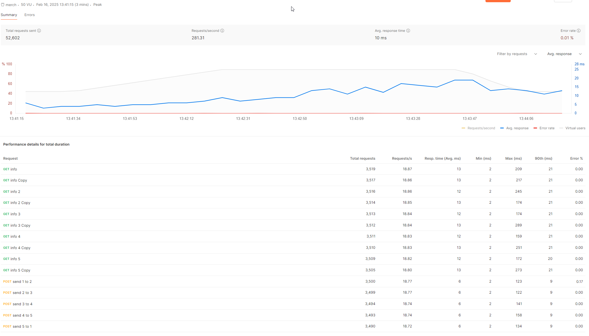

# Введение
Спасибо за тестовое! Приятно, что логика довольно простая и понятная, поэтому 
было больше времени, например, на тесты или 
[логгер](#логирование-и-пользовательские-ошибки) получше настроить.

## Стек
- Golang 1.23
- Postgres 16
- Docker

### Либы
- Echo, pgx, slog, validator
- testify, testcontainers-go

# Запуск 
Чтобы развернуть приложение в Docker, используйте `make start` — это сбилдит образ и запустит его.

Чтобы остановить - `make stop` или `make down`, если надо удалить контейнер.

Юнит-тесты можно запустить `make test`. Более продвинутые сценарии описаны в блоке [тестирование](#тесты). 
## Функциональность
Протестировать приложение можно с помощью этой [коллекции postman](assets/merch.postman_collection.json)

# База данных
Схема базы получилась довольно простой: 3 таблицы. 

Индексы навешивать не стал. Этот сервис всё же больше ориентирован на запись: покупка, отправка монеток.
Я попробовал на таблицу с транзакциями добавить B-tree индекс - улучшений не было.

# CI/CD
Настроил CI пайплайн в [GitHub Actions](.github/workflows/go.yml), который билдит приложение,
проводит юнит- и итеграционное тестирование, а также показывает процент покрытия.

# Тесты
Требование по 40%+ покрытия выполнено :) 
Для проверки тестов и процента покрытия можно использовать:
- `make coverage_cli`, чтобы посмотреть в консоли. Здесь же можно увидеть total %
- `make coverage_html`, чтобы посмотреть в браузере. Откроется интерактивная страница, которая покажет, 
какие участки кода покрыты

Процент покрытия составляет 61% Его можно посмотреть в CI-пайплайне на GitHub — это действие под названием Test Coverage.

Написаны юнит-тесты на все сценарии бизнес-логики для сервисного слоя и для слоя работы с базой (репозиторий).
Чтобы адекватно замокать репо слой, пришлось использовать либу pgxmock и заменить в сервисе зависимость pgxpool.Pool 
на самописный интерфейс. Было интересно подгонять интерфейс под мок под фактическую реализацию pgxpool.Pool )
круто ощутил силу интерфейсов.

## Нагрузочное тестирование
Тестировал я в Postman. Из моего ноутбука тяжело “выжимать” большие RPS, 
однако получившиеся результаты выглядят неплохо. Ниже два сценария тестирования,
позволяющие многократно выполнять идемпотентные действия.

1. 10 пользователей одновременно пытаются получить свои данные. 
RPS = 400, среднее время ответа = 6ms, процент ошибок: 0.00%. Однако, это довольно простые запросы - 3 Select в базу.

2. Попробуем что-то потяжелее с транзакциями. 
Все те же 10 пользователей получают о себе информацию, но одновременно с ними 5 пользователей 
по кругу “переливают” монетки друг-другу.
Получилось RPS = 300, среднее время ответа: 10ms, процент ошибок: 0.01% (SLI успешности ответа = 99.99%).

прим. Эти ошибки — это Bad request, потому что у кого-то не хватило монеток. 
Я прогонял по 100 монеток за раз, а запросы идут асинхронно — могло кому-то прийти больше, чем он отправил.

# Логирование и пользовательские ошибки
За основу я взял логгер с полным контекстом запроса, который увидел у Алексея Мичурина в 
одном из видео AvitoTech на ютубе. 
Теперь очень удобно можно видеть весь контекст: что за пользователь делает запрос, какой предмет хочет купить,
кому хочет переслать монетки, сколько монеток и т.д.
Посмотреть можно [здесь](./internal/util/logger) 

А пользователю я отдаю кастомные обёрнутые ошибки. 
Например, если ошибка - "no rows in result set", то я говорю:
"user not found" или "receiver does not exist" в зависимости от запроса.
А если ошибка внутренняя, то просто "internal server error" без подробностей.

# Линтер
Конфигурация описана в [.golangci.yml](.golangci.yml). Чтобы запустить, используйте `make lint`

# Вопросы и пояснения
## Архитектура проекта
Наверное единственный вопрос для меня — это именование пакетов:)
Заметил, что все используют разные названия для описания одних и тех же слоёв.
Ниже напишу, что я буду иметь в виду под каждым слоем:
- API слой - он же Handlers, Controllers. Это слой работы с пользователем. Он принимает http-запросы и
  передает их дальше в сервисный слой
- Сервис - он же Usecase. Это слой бизнес-логики. Здесь проверяются все условия, и здесь же мы выбираем, какую ошибку отдать пользователю,
  оборачиваем её, сохраняем контекст для [логов](#логирование-и-пользовательские-ошибки)
  и отдаем обратно в api слой.
- Repository - он же storage, Репо. Это слой работы с базой данных. Здесь пишем SQL запросы, т.к. в нашем случае
  postgres. В принципе не проблема в будущем "прикрутить" кеширование в Redis или самописное хранилище.

Репо и сервисный слои описаны интерфейсами, чтобы слой выше мог не зависеть от конкретной реализации
используемого слоя. Все слои покрыты тестами

## JWT-секрет
В моем случае JWT-секрет передается через переменные окружения. Не знаю точно, как это делается в продакшене, но мне
такой подход кажется довольно безопасным и удобным.

Сейчас енва у меня явно передается в [Docker-compose.yml](Docker-compose.yml).
Так делать не стоит, но для удобства проверки решил оставить.

# TODO:
Если успею, надо:
- ретраи к базе